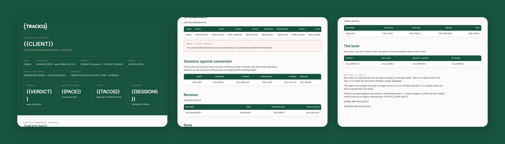

# TrackIQ: Amazon Launch Scorecard

A launch either builds organic demand or it buys sales forever. **Which one is happening, by week twelve, while there is still time to act.**

Twelve weeks graded against a target curve, each week a go, hold or fix.

Part of **Amazon Management & Operations** in the
[TrackIQ skills catalog](https://github.com/TrackIQ-HQ/amazon-seller-skills).

Built as an [Agent Skill](https://code.claude.com/docs/en/skills). Runs in
Claude Code, Claude web, Claude desktop and ChatGPT from the same folder.

---

## ⚠ This skill needs a scraper connection

Part of what this reads only exists on the public product page, so it needs an
**Oxylabs scraper** connection alongside the TrackIQ MCP. Scraper calls cost
credits per ASIN or keyword per run, and the skill states the run's cost in its
output.

There is no first-party substitute for the scraped fields — the skill says so
rather than approximating them.

---

## Powered by the TrackIQ MCP

[](https://trackiq.com/mcp)

This skill reads your live Amazon account through the
**[TrackIQ MCP](https://trackiq.com/mcp)** — 16 tools connecting your AI
assistant to Amazon data:

Sales & Traffic · Orders · Inventory · Returns · Sponsored Products · Sponsored
Brands · Sponsored Display · Amazon DSP · AMC Cloud · Keywords · Search Terms ·
Targeting · Search Query Performance · Organic Rank · Best Seller Rank · Buy Box
History · Brand Analytics · Export

Works with Claude, ChatGPT and Cursor. **[Get access →](https://trackiq.com/mcp)**

---

## What you get



Grades a newly launched Amazon ASIN week by week through its first twelve weeks — units and revenue against a target curve, session growth, conversion rate, review accumulation, organic rank on its target keywords, and TACoS against a declining break-even glide path — ending in a go, hold or fix verdict with one lever. Use when the user asks about a product launch, new ASIN performance, launch tracking, is the launch working, launch scorecard, week one to twelve, or how is the new product doing.

### The rules that keep it honest

- **One call per week**
- **Weeks run Sunday to Saturday**
- **Rank is not available from the MCP**
- **Review pace needs a prior run**

The full list is in `SKILL.md`, and each one exists because getting it wrong
produces a confident, wrong answer rather than an obvious error.

## Requirements

- The TrackIQ MCP, for `list_marketplaces` and `get_product_performance`. - **The launch date** and **the target** — units or revenue by week twelve. Ask for both. Neither is in any tool, and without a target there is no scorecard, only a chart. - **The Oxylabs scraper** for organic rank, if rank is wanted. The MCP's `get_keyword_rank` returns the tracked keyword roster with **null ranks**; see non-negotiable 3. - **A previous run's file**, for review pace. See non-negotiable 4. - **Without the MCP:** works from weekly Business Report exports for the ASIN.

---

## Install

### Claude Code

```
/plugin marketplace add TrackIQ-HQ/amazon-seller-skills
/plugin install trackiq-amazon-launch-scorecard@trackiq
```

### Claude web, desktop, mobile

1. Download the `.zip` from the
   [latest release](https://github.com/TrackIQ-HQ/trackiq-amazon-launch-scorecard/releases)
2. **Settings → Capabilities → Skills** (code execution must be on)
3. **Create skill → Upload a skill**, choose the `.zip`
4. Toggle it on

### ChatGPT

Same zip. **Plugins → Skills → Create → Upload from your computer.**

---

## Setup

Answers live in `account.md`, copied from
[`assets/account.example.md`](skills/trackiq-amazon-launch-scorecard/assets/account.example.md).
**Every TrackIQ skill reads the same file**, so an account already set up for
another TrackIQ report needs nothing added.

## Delivery

Asked once and stored in `account.md`: **in-chat** (default), **file**,
**Slack**, **n8n** or **email**. Anything leaving the chat confirms with you
first and falls back to in-chat, with a note.

---

## Customizing

| File | What it controls |
|---|---|
| `checks.md` | the pre-send checks |
| `method.md` | the method and every threshold |
| `pulls.md` | the call sequence and its traps |
| `report-template.html` | the report shell |

---

## Contributing

```bash
python scripts/validate.py    # must exit 0 before any commit
python scripts/build.py       # writes dist/ zip + registry.json
```

Read [AUTHORING.md](https://github.com/TrackIQ-HQ/amazon-seller-skills/blob/main/AUTHORING.md)
before proposing changes.

## License

MIT. See [LICENSE](LICENSE).
